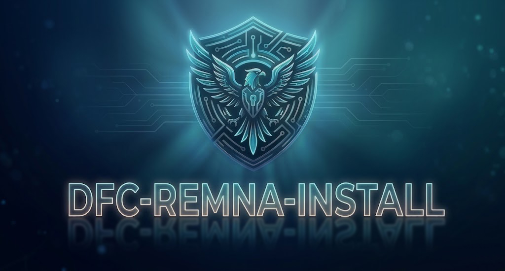

<p align="center">
  
</p>

<p align="center">
  <a href="README.md">Русский</a> | <a href="README.en.md">English</a>
</p>

<p align="center">
  
  
  
</p>

<h1 align="center">🛡️ DFC Manager</h1>
<p align="center">Интерактивный установщик и менеджер <a href="https://github.com/remnawave/panel">Remnawave VPN Panel</a><br>с NGINX, SSL, cookie-защитой, MTProto прокси, мониторингом Beszel и полным набором инструментов управления</p>

---

## 🚀 Установка

```bash
bash <(curl -s https://raw.githubusercontent.com/DanteFuaran/dfc-install/main/install.sh)
```

<sub>При запуске будет запрошен ключ доступа. После установки управление доступно через команду <b><code>dfc-manager</code></b> или <b><code>dfc</code></b></sub>

---

<h2> $${\color{blue}🗂️ Структура\ меню}$$ </h2>

<details>
<summary>$${\color{gray}Показать\ подробности:}$$<br></summary>

Скрипт построен на интерактивном меню с навигацией стрелками. После запуска `dfc` открывается **главное меню**:

```
🛠️  DFC Manager
──────────────────────────────────────
  📦  Remnawave - Панель
  📊  Beszel - Мониторинг
  📡  MTProto - TG Прокси
  ──────────────────────────────────────
  🧩  Дополнительные программы
  🧪  Тестирование сервера
  ⚙️   Оптимизация сервера
  ──────────────────────────────────────
  🗑️   Удаление компонентов
  ──────────────────────────────────────
  ❌  Выход
```

</details>

---

<h2> $${\color{blue}📦 Remnawave\ —\ Панель}$$ </h2>

<details>
<summary>$${\color{gray}Показать\ подробности:}$$<br></summary>

### 📦 Установить компоненты

При первом запуске доступна установка. Мастер установки проведёт через выбор конфигурации:

**🖥️ Установить Панель Remnawave**

Сначала задаётся вопрос о странице подписки:
| Выбор | Описание |
|---|---|
| Установить на этот сервер *(рекомендуется)* | Страница подписки будет развёрнута на том же VPS |
| Установлю на отдельный сервер | Страница подписки настраивается вручную позже |

Затем — вопрос о ноде:
| Выбор | Описание |
|---|---|
| Установить на этот сервер | Нода будет развёрнута на том же VPS |
| Установлю на отдельный сервер *(рекомендуется)* | Нода на отдельном сервере для большей безопасности |

В зависимости от ответов скрипт выполнит одну из комбинаций: **Панель + Нода + Подписка**, **Панель + Подписка**, **Панель + Нода** или **только Панель**.

**➕ Подключить ноду к панели** *(если панель уже установлена)*
> Добавляет новую ноду Remnawave на сервер с уже работающей панелью. Обновляет NGINX-конфигурацию автоматически.

**📄 Установить Страницу подписки** *(если не установлена)*
> Разворачивает сервис `subscribe-page` — красивая страница для клиентов с QR-кодами и инструкциями по подключению.

**🌐 Установить Ноду** *(если не установлена)*
> Устанавливает отдельную Remnawave-ноду на текущий сервер для подключения к уже установленной панели.

---

### ▶️ Запустить сервисы
> Запускает все установленные Docker-контейнеры (`docker compose up -d`) — панель, ноду, NGINX, PostgreSQL.

### ⏹️ Остановить сервисы
> Останавливает все запущенные контейнеры (`docker compose down`).

### 📋 Просмотр логов
> Выводит живой поток логов всех сервисов (`docker compose logs -f`). Выход — `Ctrl+C`.

---

### 💾 Управление базой данных

```
  💾  Сохранить базу данных
  📥  Загрузить базу данных
  ──────────────────────────────────────
  ⚙️   Включить автобекап  /  Изменить настройки автобекапа
  ⛔  Остановить автобекап  (если активен)
```

| Пункт | Описание |
|---|---|
| **💾 Сохранить базу данных** | Создаёт архив `.tar.gz` с дампом PostgreSQL и директорией `/opt/remnawave` |
| **📥 Загрузить базу данных** | Восстанавливает панель из ранее сохранённого архива |
| **⚙️ Включить автобекап** | Настраивает cron-задачу с отправкой архива в Telegram-чат или канал |
| **⛔ Остановить автобекап** | Останавливает и удаляет cron-задачу |

Частота автобекапов: `каждые 6 ч` / `12 ч` / `24 ч` / `48 ч`

---

### 🔓 Настройки

```
  🔐  Сбросить суперадмина
  🌐  Сменить домены
  🍪  Сменить cookie доступа
  🎨  Сменить сайт-заглушку
  ──────────────────────────────────────
  🔗  Показать ссылку входа
  ──────────────────────────────────────
  🔒  Переключить панель на 443 / 8443
```

| Пункт | Описание |
|---|---|
| **🔐 Сбросить суперадмина** | Генерирует новый логин и пароль суперадмина без переустановки панели |
| **🌐 Сменить домены** | Открывает подменю смены доменов (см. ниже) |
| **🍪 Сменить cookie доступа** | Генерирует новые cookie — все старые ссылки немедленно инвалидируются |
| **🎨 Сменить сайт-заглушку** | Меняет HTML-шаблон маскировки на корневом домене ноды |
| **🔗 Показать ссылку входа** | Выводит текущую cookie-ссылку для входа в панель |
| **🔒 Переключить панель на 443 / 8443** | Переключает порт прямого доступа к панели |

**Подменю 🌐 Сменить домены:**
```
  🌐  Сменить домен панели
  🌐  Сменить домен страницы подписки
  🌐  Сменить домен ноды
```
> Каждая смена автоматически перевыпускает SSL-сертификат и обновляет конфигурацию NGINX.

---

### 🔄 Обновить панель/ноду
> Скачивает актуальные Docker-образы Remnawave и перезапускает контейнеры без потери данных.

</details>

---

<h2> $${\color{blue}📊 Beszel\ —\ Мониторинг}$$ </h2>

<details>
<summary>$${\color{gray}Показать\ подробности:}$$<br></summary>

[Beszel](https://beszel.dev) — лёгкая система мониторинга серверов с веб-интерфейсом.

```
  📊  Установить панель Beszel
  🖥️   Подключить агент (ноду)
  ──────────────────────────────────────
  🌐  Изменить домен Beszel        (если хаб установлен)
  🔗  Изменить адрес хаба агента   (если только агент)
```

| Пункт | Описание |
|---|---|
| **📊 Установить панель Beszel** | Разворачивает хаб мониторинга с веб-интерфейсом и SSL через NGINX |
| **🖥️ Подключить агент** | Устанавливает агент сбора метрик на текущий сервер |
| **🌐 Изменить домен Beszel** | Меняет домен хаба с перевыпуском SSL |
| **🔗 Изменить адрес хаба** | Обновляет адрес хаба у установленного агента |

</details>

---

<h2> $${\color{blue}📡 MTProto\ —\ TG\ Прокси}$$ </h2>

<details>
<summary>$${\color{gray}Показать\ подробности:}$$<br></summary>

Установка и управление MTProto прокси-сервером для Telegram.

```
  📦  Установить / Переустановить MTProto
  ⬆️   Обновить образ
  ──────────────────────────────────────
  📊  Статистика подключений
  📄  Конфигурация и ссылка
  🔑  Сменить конфигурацию
  ──────────────────────────────────────
  ▶️   Запустить прокси    /  ⏹️ Остановить прокси
  🔄  Перезапустить прокси
```

| Пункт | Описание |
|---|---|
| **📦 Установить MTProto** | Разворачивает контейнер `telegrammessenger/proxy` с выбранным портом и секретом |
| **⬆️ Обновить образ** | Обновляет Docker-образ прокси до актуальной версии |
| **📊 Статистика подключений** | Показывает текущее число подключений и трафик |
| **📄 Конфигурация и ссылка** | Выводит `tg://` ссылку для подключения к прокси |
| **🔑 Сменить конфигурацию** | Меняет порт и секрет прокси |
| **▶️ / ⏹️ Запустить / Остановить** | Управление состоянием контейнера |
| **🔄 Перезапустить** | Перезапускает контейнер прокси |

</details>

---

<h2> $${\color{blue}🧩 Дополнительные\ программы}$$ </h2>

<details>
<summary>$${\color{gray}Показать\ подробности:}$$<br></summary>

```
  🔥  UFW - Firewall
  🌐  WARP - Cloudflare
  🛡️   Fail2ban - Defence
```

| Инструмент | Описание |
|---|---|
| **🔥 UFW — Firewall** | Настройка межсетевого экрана: добавление/удаление правил, разрешённые порты, включение/выключение |
| **🌐 WARP — Cloudflare** | Установка Cloudflare WARP для исходящих подключений через сеть Cloudflare |
| **🛡️ Fail2ban** | Защита от брутфорса SSH и других сервисов: установка, настройка, просмотр блокировок |

</details>

---

<h2> $${\color{blue}🧪 Тестирование\ сервера}$$ </h2>

<details>
<summary>$${\color{gray}Показать\ подробности:}$$<br></summary>

```
  ⚡  Тест скорости сети
  🌍  Доступность популярных сервисов
  🔒  Региональные ограничения
  📍  Геолокация IP
```

| Пункт | Описание |
|---|---|
| **⚡ Тест скорости сети** | Замер входящей и исходящей скорости интернет-канала через speedtest |
| **🌍 Доступность сервисов** | Проверка доступности популярных сервисов (Google, YouTube, Telegram и др.) с текущего сервера |
| **🔒 Региональные ограничения** | Проверка наличия региональных блокировок для вашего IP |
| **📍 Геолокация IP** | Определение страны, провайдера и информации о IP-адресе сервера |

</details>

---

<h2> $${\color{blue}⚙️ Оптимизация\ сервера}$$ </h2>

<details>
<summary>$${\color{gray}Показать\ подробности:}$$<br></summary>

```
  💾  SWAP
  🚀  BBR
```

| Пункт | Описание |
|---|---|
| **💾 SWAP** | Создание и управление swap-разделом: задать размер, включить/отключить |
| **🚀 BBR** | Включение алгоритма TCP BBR для увеличения пропускной способности и уменьшения задержек |

</details>

---

<h2> $${\color{blue}🗑️ Удаление\ компонентов}$$ </h2>

<details>
<summary>$${\color{gray}Показать\ подробности:}$$<br></summary>

Меню динамически показывает только установленные компоненты:

```
  🖥️   Remnawave (Панель)
  🌐  Remnawave (Нода)
  📄  Remnawave (Страница подписки)
  📊  Beszel (Мониторинг)
  📊  Beszel (Агент)
  📡  MTProto (Прокси)
  ──────────────────────────────────────
  🗑️   Удалить всё
```

Каждый компонент удаляется отдельно с подтверждением. При удалении страницы подписки конфигурация NGINX автоматически восстанавливается. **"Удалить всё"** удаляет все найденные компоненты сразу.

</details>

---

<h2> $${\color{blue}📦 Варианты\ установки}$$ </h2>

<details>
<summary>$${\color{gray}Показать\ подробности:}$$<br></summary>

| Вариант | Описание |
|---|---|
| **Панель + Нода + Подписка** | Полная установка всех компонентов на один VPS |
| **Панель + Подписка** | Панель с страницей подписки, нода — на отдельном сервере |
| **Панель + Нода** | Панель с нодой, страница подписки — на отдельном сервере |
| **Только панель** | Минимальная установка — только панель |
| **Подключить ноду к панели** | Добавление ноды на сервер с уже установленной панелью |
| **Только страница подписки** | Установка страницы подписки к уже существующей панели |
| **Только нода** | Установка ноды для подключения к удалённой панели |
| **MTProto прокси** | Установка MTProto прокси на отдельный сервер |
| **Beszel мониторинг** | Установка агента или хаба Beszel для мониторинга серверов |

</details>

---

<h2> $${\color{blue}✨ Возможности}$$ </h2>

<details>
<summary>$${\color{gray}Показать\ подробности:}$$<br></summary>

### 🔐 Безопасность
> **Cookie-защита доступа** — уникальная cookie-ссылка на панель вместо прямого URL<br>
> **Мгновенная смена cookie** — инвалидация всех старых ссылок в один клик<br>
> **Переключение порта панели** — работа на 443 или 8443 на выбор<br>
> **Сброс суперадмина** — генерация новых учётных данных без переустановки<br>
> **SSL-сертификаты** — Let's Encrypt HTTP-01 или Cloudflare DNS-01 wildcard

### 🌐 Управление доменами
> **Смена домена панели** — с автоматическим перевыпуском SSL<br>
> **Смена домена страницы подписки** — с автоматическим перевыпуском SSL<br>
> **Смена домена ноды / selfsteal** — обновление конфигурации<br>
> **Проверка DNS перед установкой** — скрипт убеждается что домен указывает на сервер

### 💾 База данных и резервные копии
> **Ручной бэкап** — архив БД PostgreSQL + директория `/opt/remnawave` в один `.tar.gz`<br>
> **Восстановление из бэкапа** — загрузка из любого сохранённого архива<br>
> **Автоматические бэкапы** — по расписанию (cron) с отправкой в Telegram<br>
> **Настройка расписания** — каждые 6 ч / 12 ч / 24 ч / 48 ч<br>
> **Telegram-нотификации** — архив отправляется напрямую в чат или канал

### 🎨 Сайт-заглушка (маскировка)
> Скрипт устанавливает HTML-шаблон на корневой домен ноды — сервер выглядит как обычный сайт.<br>
> Доступно **20 шаблонов** или случайный:

| | | |
|---|---|---|
| 🏢 NexCore — Корпоративный портал | 💻 DevForge — Технологический хаб | ☁️ Nimbus — Облачные сервисы |
| 💳 PayVault — Финтех платформа | 📚 LearnHub — Образовательная платформа | 🎬 StreamBox — Медиа портал |
| 🛒 ShopWave — E-commerce | 🎮 NeonArena — Игровой портал | 👥 ConnectMe — Социальная сеть |
| 📊 DataPulse — Аналитика | ₿ CryptoNex — Крипто биржа | ✈️ WanderWorld — Туризм |
| 💪 IronPulse — Фитнес | 📰 ВестникПРО — Новости | 🎵 SoundWave — Музыка |
| 🏠 HomeNest — Недвижимость | 🍕 FastBite — Доставка еды | 🚗 AutoElite — Автомобили |
| 🎨 Prisma Studio — Дизайн | 💼 Vertex Advisory — Консалтинг | 🎲 Случайный шаблон |

### 🧩 Дополнительные инструменты
> **🔥 Firewall (UFW)** — настройка и управление правилами<br>
> **🌐 WARP** — установка и управление Cloudflare WARP<br>
> **🛡️ Fail2ban** — защита от брутфорса<br>
> **💾 SWAP** — создание и управление swap-разделом<br>
> **🚀 BBR** — включение TCP BBR для оптимизации сети<br>
> **📡 MTProto прокси** — установка и управление MTProto прокси-сервером (со статистикой)<br>
> **📊 Beszel** — мониторинг сервера (агент + hub)

### ⚙️ Управление сервисами
> **Запуск / остановка** всех сервисов одной командой<br>
> **Обновление панели и ноды** — pull новых Docker-образов<br>
> **Просмотр логов** — панель, нода, NGINX, PostgreSQL в реальном времени<br>
> **Удаление компонентов** — каждый компонент отдельно или всё сразу<br>
> **Полное удаление** — все компоненты, данные и конфигурации

</details>

---

<h2> $${\color{blue}📋 Требования}$$ </h2>

<details>
<summary>$${\color{gray}Показать\ подробности:}$$<br></summary>

### 🖥️ Система
> **Ubuntu** 22.04 / 24.04<br>
> **Debian** 11 / 12<br>
> Доступ **root** или `sudo`

### 🌐 Домены и DNS
> 2–3 поддомена с **A-записями** на IP сервера

### 🔐 SSL
> Email для **Let's Encrypt**<br>
> или API Token для **Cloudflare DNS-01** (для wildcard)

<sub>⚠️ $${\color{orange}Все\ зависимости\ (Docker,\ Docker\ Compose,\ Certbot)\ устанавливаются\ автоматически.}$$</sub>

</details>

---

<h2> $${\color{red}🔧 Решение\ проблем}$$ </h2>

<details>
<summary>$${\color{gray}Показать\ подробности:}$$<br></summary>

### Убедитесь что:
> ✅ Все домены корректно указывают на IP сервера через **A-записи** в DNS<br>
> ✅ Порты **80** и **443** свободны и не заняты другими службами<br>
> ✅ Firewall разрешает входящие подключения на портах **80**, **443**, **8443**<br>
> ✅ Email для Let's Encrypt указан правильно<br>
> ✅ При использовании Cloudflare DNS-01 указан корректный **API Token**

### Решение проблем:
> 📜 Проверьте логи компонентов через `dfc` → Просмотр логов<br>
> 🔄 Попробуйте перезапустить сервисы через `dfc` → Запустить сервисы<br>
> 🆘 Если проблема не решается — откройте [Issue на GitHub](https://github.com/DanteFuaran/dfc-manager/issues) с текстом ошибки

</details>

---

<h2> $${\color{green}💰 Поддержать\ проект}$$ </h2>

<details>
<summary>$${\color{gray}Показать\ подробности:}$$<br></summary>

<br>

### 💵 Криптовалюта
> **USDT (TRC-20):** `THqJQsgbWY7Tw1BxdLA6SQAkBGVmMhzeLZ`<br>
> **BTC (BEP-20):** `0x657685922d7a9c50e3e90cae3ba9905985349fbb`

### 🇷🇺 ЮMoney
> **Номер карты:** `4100118836481809`

<br>

<sub>❤️ Спасибо за вашу поддержку! Она помогает развивать проект.</sub>

</details>

---

## 📜 Лицензия

Проект распространяется под лицензией [MIT](LICENSE)

---

<p align="center">
  <b>⭐ Поставьте звезду, если проект оказался полезным!</b>
</p>
